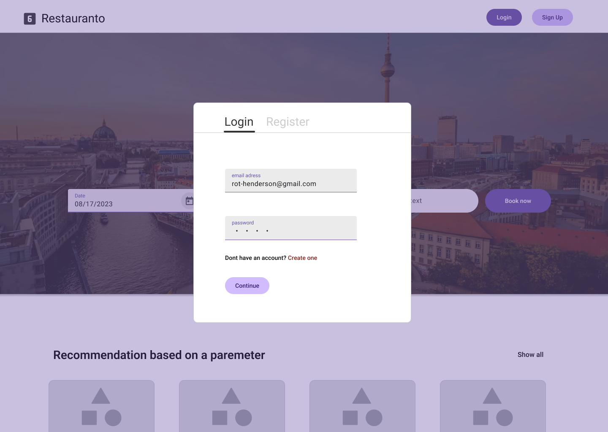

# Project Idea

## Created  Jun 30, 2023
We propose leveraging the MERN Stack to develop a sophisticated application dedicated to facilitating restaurant and café bookings. Our primary objective is to provide a seamless user experience by allowing individuals to input their desired specifications, such as the number of guests, culinary preferences, preferred price range, and location. By utilizing mock data, we will ensure a comprehensive testing environment. Moreover, our application will take on the responsibility of managing the entire reservation process efficiently. Additionally, we will implement a secure user login system to enhance privacy and accessibility.

# Wireframes
## Home

## Login

## User

## Search

## Restaurant

